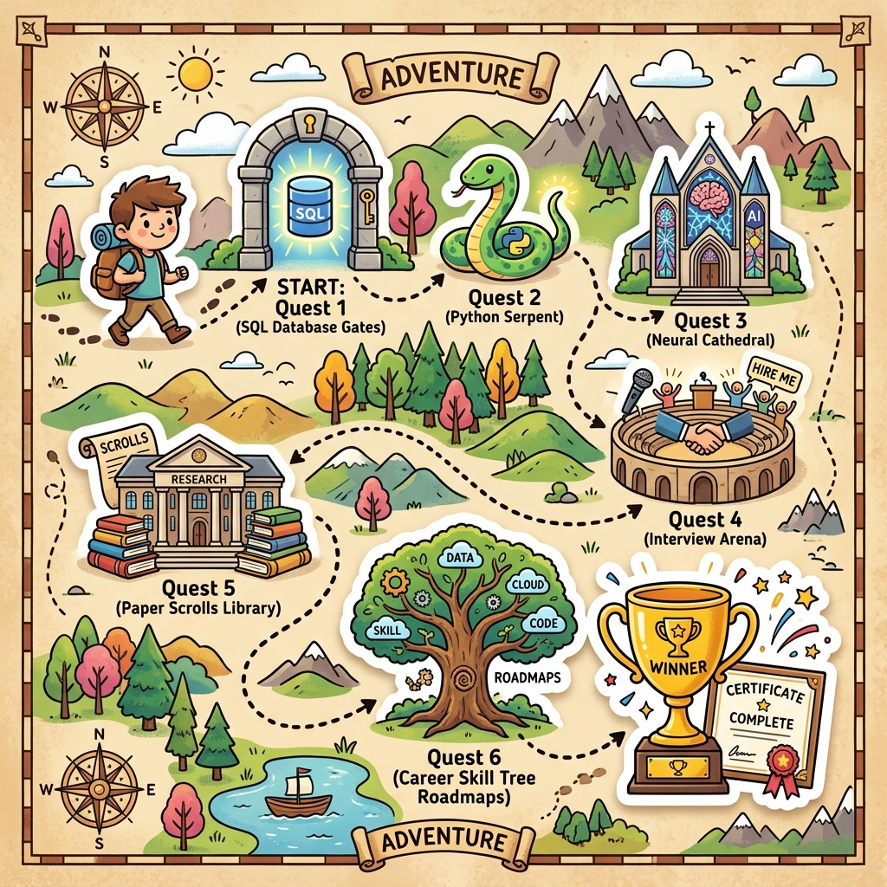
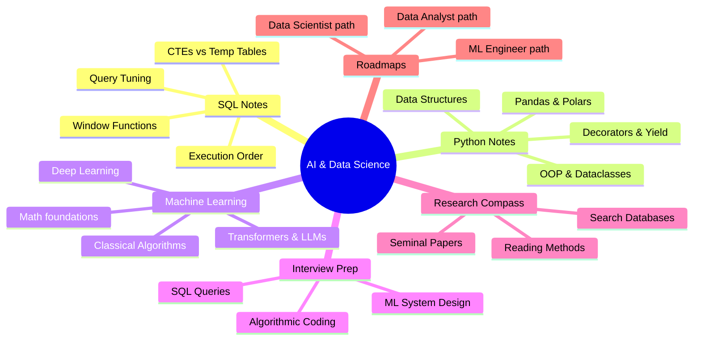
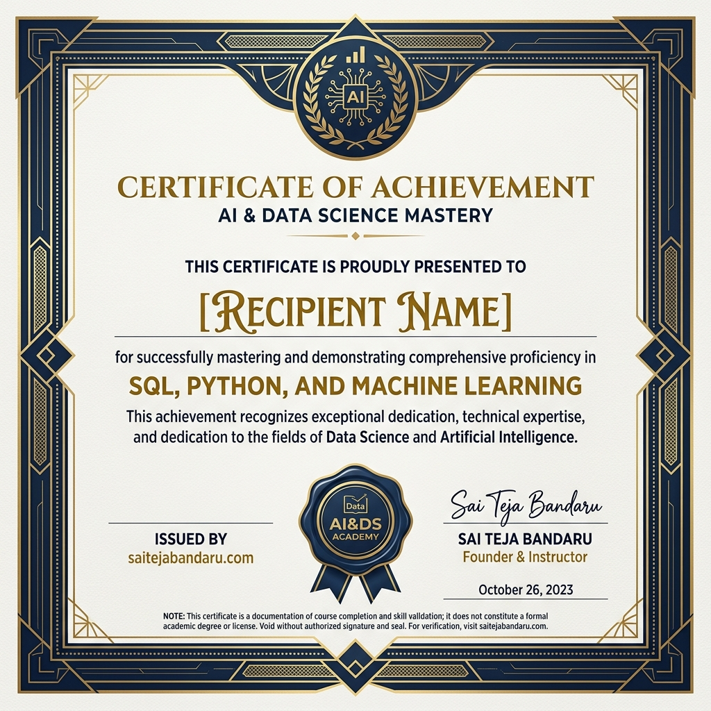
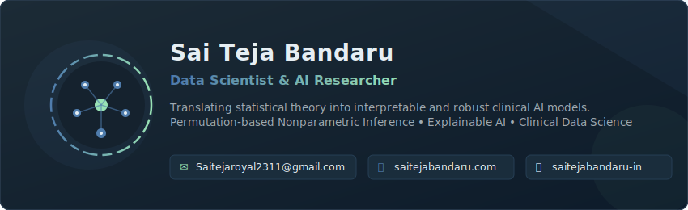

<p align="center">
  
</p>

<!-- JSON-LD Structured Data for Search Engine & AI Crawler Indexing
{
  "@context": "https://schema.org",
  "@type": "LearningResource",
  "name": "AI & Data Science Core Curriculum and Roadmaps",
  "description": "A comprehensive personal knowledge repository featuring free machine learning engineer roadmaps, advanced SQL interview queries, Python data engineering benchmarks, academic paper summaries, and interactive terminal study quests.",
  "educationalLevel": "Beginner to Advanced",
  "learningResourceType": "Roadmap / Study Guide",
  "author": {
    "@type": "Person",
    "name": "Sai Teja Bandaru"
  },
  "url": "https://github.com/saitejabandaru-in/AI-Data-Science-Resources"
}
-->

<div align="center">
  <p align="center">
    <strong>⚔️ Welcome, Initiate, to the Grand Archive of AI & Data Science! ⚔️</strong><br/>
    This is not a boring textbook repository. This is an interactive, gamified journey through the core realms of databases, computation, intelligence, and system architecture. Track your stats, conquer programming quests, run terminal benchmarks, and defeat the guardian to claim a verified LinkedIn Badge!
  </p>
</div>

---

> ### 🧚 Once Upon a Time... (A 5-Line Storybook Summary)
> Once upon a time, in a digital kingdom, there was a vast library of secrets. Inside, SQL was a clever chef who grabbed the right ingredients, Python was a magical snake that helped automate tasks, and Machine Learning was a puppy learning tricks from pictures. This archive is your map to explore these wonders, solve interactive challenges, and earn your golden certificate badge!

<p align="center">
  
</p>

---

## 🎮 The Adventure Rules & Player Stats

Before you embark on the paths below, initialize your quest log. 

1. **Your Starting Class:** Initiate
2. **Current Level:** 1
3. **Objective:** Complete the 6 major quests, run the performance trials, and defeat the **Neural Guardian** in the Certification Arena.
4. **Interactive Quest Log:** Run the local terminal companion to track your progress and claim daily challenges!
   ```bash
   python3 scripts/study_quest.py
   ```

---

## 🔥 Why Star This Repository?

> [!TIP]
> *   **🛡️ Complete Questline:** From SQL CTEs to training custom Transformers and RAG pipelines, everything is organized as a smooth progression.
> *   **⚡ Interactive Terminal Trials:** Don't just read notes—run live speed benchmarks (`scripts/benchmark_lab.py`) comparing Python, Pandas, and Rust-powered Polars, or watch an artificial neuron train step-by-step in your terminal (`scripts/nn_simulator.py`).
> *   **📜 Seminal Papers Compass:** Easily navigate foundational AI literature with our structured academic reading guides and curated database links.
> *   **💎 100% Free Resources Library:** Hand-picked courses, textbooks, datasets, and cheat sheets to take you from a complete beginner to a confident practitioner.

---

## ⚔️ The Quest Board: Six Paths to Mastery

Choose your quest below. Each path represents a major pillar of Data Science and Artificial Intelligence.

| Path | Quest Name | Difficulty | XP Reward | Key Challenges & Concepts |
| :--- | :--- | :--- | :--- | :--- |
| **📊 Quest 1** | [The Gates of Query Haven](./sql/README.md) | 🟢 Easy | `150 XP` | Query Execution Pipelines, Joins, Window Functions, and Index Tuning. |
| **🐍 Quest 2** | [The Serpent's Catalyst](./python/README.md) | 🟡 Medium | `250 XP` | ABC Abstractions, Yields, Vectorization Speedups, and Polars Rust Engines. |
| **🧠 Quest 3** | [The Cathedral of Learning](./machine-learning/README.md) | 🔴 Hard | `500 XP` | Optimization Calculus, Deep Backprop, Causal Self-Attention, LoRA, and RAG. |
| **💼 Quest 4** | [The Colosseum of Interviews](./interviews/README.md) | 🔴 Hard | `400 XP` | Algorithmic Coding, Complex Query Scenarios, and ML System Design Funnels. |
| **🔬 Quest 5** | [The Scroll of Seminal Whispers](./research-resources/README.md) | 🟡 Medium | `200 XP` | Three-Pass Reading Method, Literature Discovery, and Classic AI Papers. |
| **🛤️ Quest 6** | [The Cartographer's Guild](./roadmaps/README.md) | 🟢 Easy | `100 XP` | Choosing your class (MLE, DS, DA) and mapping your personalized skill trees. |

---

## 🧠 Curriculum Mindmap



---

## 🧭 How to Use This Repository (For Absolute Beginners & Kids!)

If you have never coded before and have no idea what a "repository" or "terminal" is, do not worry! Here is a simple, step-by-step guide to help you get started.

### 📍 Step 1: Install Python (The Magic Engine)
Python is the engine that runs our games. We need to install it on your computer:
*   **For Windows:** Go to the [Official Python Download Page](https://www.python.org/downloads/), click the big yellow **Download Python** button, open the downloaded file, and **make sure you check the box that says "Add Python.exe to PATH"** before clicking Install.
*   **For Mac:** Open the terminal and type `python3 --version`. If it asks you to install developer tools, click Install! Or download it from the python page.

### 📍 Step 2: Download the Code Folder
*   **Option A (For beginners):** Click the green **Code** button at the top right of this web page, then click **Download ZIP**. Extract the downloaded ZIP folder to your Desktop!
*   **Option B (For git users):** Clone the repository via terminal:
    ```bash
    git clone https://github.com/saitejabandaru-in/AI-Data-Science-Resources.git
    cd AI-Data-Science-Resources
    ```

### 📍 Step 3: Open Your Command Terminal (The Control Room)
The terminal is a text control room where you type commands to your computer:
*   **On Windows:** Click your Start button, search for **cmd** (Command Prompt), and click to open it.
*   **On Mac/Linux:** Press `Command + Space` (or search applications), type **Terminal**, and press Enter.

### 📍 Step 4: Navigate to the Folder
Type the following command into your terminal and press Enter to go inside the folder:
```bash
cd Desktop/AI-Data-Science-Resources-main
```
*(If you cloned the repo using git in Step 2, you just need to type `cd AI-Data-Science-Resources`!)*

### 📍 Step 5: Start the Games & Quizzes!
Now, type any of these commands and press Enter to run our interactive labs:
*   **Run the RPG Quest Log:**
    ```bash
    python3 scripts/study_quest.py
    ```
*   **Run the Certification Quiz Arena:**
    ```bash
    python3 scripts/quiz_generator.py
    ```
*   **Run the Performance Benchmark Lab:**
    ```bash
    python3 scripts/benchmark_lab.py
    ```
*   **Run the Visual Neural Network Simulator:**
    ```bash
    python3 scripts/nn_simulator.py
    ```

---

## 🏆 The Graduation Quest: How to Get Certified

Once you have read the notes in each quest folder, you can enter the **Certification Arena** by running the quiz script!

<p align="center">
  
</p>

### 🎖️ How to Earn Your Certificate:
1. **Pass the Quiz**: Run `python3 scripts/quiz_generator.py` and answer the 9 questions.
2. **Score Required**: You must get **8 out of 9** correct answers.
3. **Earn the Rewards**: Once you score 8/9 or higher:
   * **Custom Certificate File (`CERTIFICATE.md`)**: Created automatically inside your folder, customized with your name, date, and score!
   * **Verification Badge (`AI_Data_Science_Badge.svg`)**: A glowing digital SVG badge created in your folder!
   * **LinkedIn Integration**: The terminal will print a special **Add to Profile** link. Click it, and it will automatically fill out the certificate form on LinkedIn so you can add it to your profile with one click!

### 🌟 Benefits of Your Certificate:
* **Authorized & Issued by saitejabandaru.com**: Your certificate is officially issued by **saitejabandaru.com** and authorized/signed by **Sai Teja Bandaru** (Founder & Instructor).
* **LinkedIn Ready**: Add it to your LinkedIn profile under "Licenses & Certifications" to show teachers, universities, and future employers that you mastered the fundamentals!
* **Share Everywhere**: Share the glowing badge on Twitter, GitHub, or print the certificate to hang on your wall!

> ⚠️ **Disclaimer Note:** This certificate is documentation of course completion and self-paced study validation for an open-source learning path. It does not constitute a formal academic degree, professional license, or accredited credential from any university, legal authority, or licensing body.

---

## 🧸 Intuitive Concept Analogies

Data Science and AI can sound like a different language. To help you learn, **every folder in this repository features an intuitive analogy section** that uses simple real-world comparisons to explain complex topics before diving into the advanced code and math.

---

## 🎁 Ultimate Free Learning Resources Library

Here is a curated compilation of the absolute best free courses, textbooks, datasets, and cheat sheets available on the web.

### 🎓 1. Best Free Courses
*   **Mathematics for ML:** [Imperial College London Mathematics for Machine Learning (YouTube)](https://www.youtube.com/playlist?list=PLiiljT3NqomXHyL9F1IjYtXyH295d43T0) - Linear Algebra and Multivariate Calculus.
*   **Machine Learning (Andrew Ng):** [Stanford CS229: Machine Learning (YouTube)](https://www.youtube.com/playlist?list=PLoROMvodv4rMiGQp3WXSihR70JHGPFiLy) - The Gold Standard for ML math.
*   **Deep Learning:** [Fast.ai: Practical Deep Learning for Coders](https://course.fast.ai/) - Top-tier top-down coding-first course.
*   **Neural Networks from Scratch:** [Andrej Karpathy's Zero to Hero](https://karpathy.ai/zero-to-hero.html) - Step-by-step neural network implementations.
*   **NLP & Transformers:** [Hugging Face NLP Course](https://huggingface.co/learn/nlp-course) - Learn tokenizer, models, pipelines, and dataset APIs.
*   **SQL Mastery:** [Select Star SQL](https://selectstarsql.com/) - Interactive SQL book for beginners.

### 📚 2. Best Free Textbooks (with PDFs)
*   **Classical ML:** [An Introduction to Statistical Learning (ISL) with Python](https://www.statlearning.com/) - Essential reading for ML theory.
*   **Deep Learning:** [Deep Learning Book by Goodfellow, Bengio, and Courville](https://www.deeplearningbook.org/) - Comprehensive theoretical textbook.
*   **Reinforcement Learning:** [Reinforcement Learning: An Introduction by Sutton & Barto](http://incompleteideas.net/book/the-book-2nd.html) - The ultimate guide.

### 📂 3. Best Dataset Repositories
*   **[Kaggle Datasets](https://www.kaggle.com/datasets)** - Thousands of public datasets for project practice.
*   **[Hugging Face Datasets](https://huggingface.co/datasets)** - Large-scale datasets for NLP, Audio, and Computer Vision.
*   **[UCI Machine Learning Repository](https://archive.ics.uci.edu/)** - The classic repository for academic datasets.

### 📝 4. Best Cheat Sheets
*   **Python:** [Python Cheat Sheet (Comprehensive)](https://www.pythoncheatsheet.org/)
*   **Data Science / NumPy / Pandas:** [DataCamp Cheat Sheets Catalog](https://www.datacamp.com/blog/category/cheat-sheets)
*   **Machine Learning Math:** [Stanford CS229 VIP Cheatsheets](https://stanford.edu/~shervine/teaching/cs-229/)

---

## ❓ Frequently Asked Questions (FAQ) - Career & Study Compass

### What is the best roadmap to become a Machine Learning Engineer (MLE)?
To become an ML Engineer, start with Python programming, linear algebra, and calculus. Progress to classical machine learning (using libraries like Scikit-Learn and XGBoost), then deep learning (PyTorch), and finally master model deployment, MLOps, and scalable pipelines (Docker, FastAPI, Triton). You can follow our step-by-step visual roadmap guide in the [Visual Career Roadmaps module](./roadmaps/README.md).

### How can I practice SQL for Data Science and Data Analyst interviews?
The best way is to focus on advanced queries involving multi-table joins, subqueries, common table expressions (CTEs), and window functions. Practice writing queries for growth metrics, running totals, and consecutive login streaks (Gaps and Islands). Access our curated bank of [Advanced SQL Interview Questions & Answers](./interviews/README.md) for direct preparation.

### Why should I choose Polars over Pandas for scientific computing?
Polars is written in Rust and utilizes parallel execution and lazy evaluation, which optimizes query plans before execution. Unlike Pandas, Polars bypasses Python's Global Interpreter Lock (GIL), resulting in speeds up to 100x faster for large datasets. Run our [Scientific Performance Benchmark Lab](./scripts/benchmark_lab.py) to measure the speedup on your own computer.

### How do I learn Generative AI, LLMs, and RAG?
Begin by studying the transformer self-attention mechanism from the paper "Attention Is All You Need". Next, understand Parameter-Efficient Fine-Tuning (PEFT/LoRA) and Retrieval-Augmented Generation (RAG) pipelines. Dive into the complete conceptual guide inside our [Machine Learning & Deep Learning module](./machine-learning/README.md).

---

## 🤝 How to Contribute

If you find these notes helpful, drop a ⭐️ to help others discover them! Found an issue, typo, or want to add a note? Feel free to create an issue or submit a pull request!

---

## 👤 Meet the Author

<p align="center">
  
</p>

<p align="center">
  <a href="https://www.saitejabandaru.com/" target="_blank">
    
  </a>
  &nbsp;
  <a href="mailto:Saitejaroyal2311@gmail.com">
    
  </a>
  &nbsp;
  <a href="https://www.linkedin.com/in/saitejabandaru-ds/" target="_blank">
    
  </a>
</p>

<p align="center">
  <a href="https://scholar.google.com/citations?user=lVrMCY4AAAAJ&hl=en" target="_blank">
    
  </a>
  &nbsp;
  <a href="https://github.com/saitejabandaru-in" target="_blank">
    
  </a>
  &nbsp;
  <a href="https://orcid.org/0009-0006-7797-2635" target="_blank">
    
  </a>
  &nbsp;
  <a href="https://www.researchgate.net/profile/Sai-Teja-Bandaru" target="_blank">
    
  </a>
  &nbsp;
  <a href="https://sciprofiles.com/profile/saitejabandaru" target="_blank">
    
  </a>
</p>
