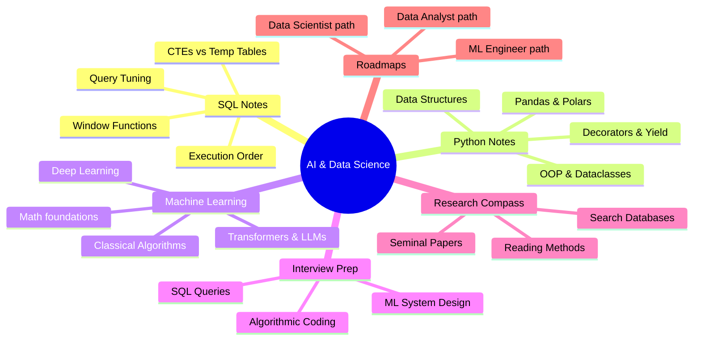

<p align="center">
  
</p>

<div align="center">


<p align="center">
  A premium, structured personal knowledge repository containing core theory, coding patterns, interactive quizzes, interview preparation guides, academic research roadmaps, and curated free resources.
  <br />
  <strong>🎓 Designed for absolute beginners: Every file features intuitive concept analogies!</strong>
</p>

</div>

---

## 🧸 Intuitive Concept Analogies

Data Science and AI can sound like a different language. To help you learn, **every folder in this repository features an intuitive analogy section** that uses simple real-world comparisons to explain complex topics before diving into the advanced code and math.

---

## 🧠 Curriculum Mindmap



---

## 🗺️ Table of Contents

- [📊 SQL Core & Advanced Notes](./sql/README.md) - CTEs, Window Functions, Query Execution, Indexing, and Optimization.
- [🐍 Python & Scientific Computing](./python/README.md) - Advanced Patterns, Memory/Speed Profiling, NumPy, Pandas, and Polars.
- [🧠 Machine Learning & Deep Learning](./machine-learning/README.md) - ML Math, Core Algorithms, Deep Learning, Transformers, LLMs, and RAG.
- [💼 Interview Prep & Case Studies](./interviews/README.md) - Algorithmic Coding, SQL Scenarios, and ML System Design.
- [🔬 Academic Research Compass](./research-resources/README.md) - Seminal Papers Tracker, Reading Methodologies, and Databases.
- [🛤️ Career Roadmaps](./roadmaps/README.md) - Role-specific career flowcharts (MLE, DS, Analyst) in Mermaid.
- [🎮 Interactive Knowledge Quiz](./scripts/quiz_generator.py) - Terminal-based CLI review tool for testing your skills.

---

## 🎁 Ultimate Free Learning Resources Library

Here is a curated compilation of the absolute best free courses, textbooks, datasets, and cheat sheets available on the web.

### 🎓 1. Best Free Courses
*   **Mathematics for ML:** [Imperial College London Mathematics for Machine Learning (YouTube)](https://www.youtube.com/playlist?list=PLiiljT3NqomXHyL9F1IjYtXyH295d43T0) - Linear Algebra and Multivariate Calculus.
*   **Machine Learning (Andrew Ng):** [Stanford CS229: Machine Learning (YouTube)](https://www.youtube.com/playlist?list=PLoROMvodv4rMiGQp3WXSihR70JHGPFiLy) - The Gold Standard for ML math.
*   **Deep Learning:** [Fast.ai: Practical Deep Learning for Coders](https://course.fast.ai/) - Top-tier top-down coding-first course.
*   **Neural Networks from Scratch:** [Andrej Karpathy's Zero to Hero](https://karpathy.ai/zero-to-hero.html) - Step-by-step neural network implementations.
*   **NLP & Transformers:** [Hugging Face NLP Course](https://huggingface.co/learn/nlp-course) - Learn tokenizer, models, pipelines, and dataset APIs.
*   **SQL Mastery:** [Select Star SQL](https://selectstarsql.com/) - Interactive SQL book for beginners.

### 📚 2. Best Free Textbooks (with PDFs)
*   **Classical ML:** [An Introduction to Statistical Learning (ISL) with Python](https://www.statlearning.com/) - Essential reading for ML theory.
*   **Deep Learning:** [Deep Learning Book by Goodfellow, Bengio, and Courville](https://www.deeplearningbook.org/) - Comprehensive theoretical textbook.
*   **Reinforcement Learning:** [Reinforcement Learning: An Introduction by Sutton & Barto](http://incompleteideas.net/book/the-book-2nd.html) - The ultimate guide.

### 📂 3. Best Dataset Repositories
*   **[Kaggle Datasets](https://www.kaggle.com/datasets)** - Thousands of public datasets for project practice.
*   **[Hugging Face Datasets](https://huggingface.co/datasets)** - Large-scale datasets for NLP, Audio, and Computer Vision.
*   **[UCI Machine Learning Repository](https://archive.ics.uci.edu/)** - The classic repository for academic datasets.

### 📝 4. Best Cheat Sheets
*   **Python:** [Python Cheat Sheet (Comprehensive)](https://www.pythoncheatsheet.org/)
*   **Data Science / NumPy / Pandas:** [DataCamp Cheat Sheets Catalog](https://www.datacamp.com/blog/category/cheat-sheets)
*   **Machine Learning Math:** [Stanford CS229 VIP Cheatsheets](https://stanford.edu/~shervine/teaching/cs-229/)

---

## 🎮 Interactive CLI Labs & Simulators

This repository is designed to be fully hands-on! We have built three interactive command-line interface (CLI) utilities for you to run in your terminal. They require zero external dependencies to execute!

### 1. 🎓 AI & Data Science Quiz CLI
Test your knowledge with conceptual multiple-choice questions on SQL, Python, and Machine Learning.
*   **Run command:**
    ```bash
    python3 scripts/quiz_generator.py
    ```
*   **Features:** Score tracking, randomized orders, and immediate detailed conceptual answers.

### 2. ⚡ Scientific Computing Performance Lab
Compare execution times between traditional Python loops, Pandas `.apply()`, Pandas vectorized arithmetic, and Polars. See Rust performance in action!
*   **Run command:**
    ```bash
    python3 scripts/benchmark_lab.py
    ```
*   **Features:** Simulates 100,000 transaction rows and builds a real-time execution speeds leaderboard.

### 3. 🧠 Visual Neural Network Perceptron Simulator
Watch a single artificial neuron learn logical gates (AND/OR) right in your terminal.
*   **Run command:**
    ```bash
    python3 scripts/nn_simulator.py
    ```
*   **Features:** Animated ASCII grid visualization showing the linear decision boundary shifting and rotating in real-time as training weights adjust.

---

## 🤝 How to Use & Contribute

1.  **Clone the Repository:**
    ```bash
    git clone https://github.com/saitejabandaru-in/AI-Data-Science-Resources.git
    cd AI-Data-Science-Resources
    ```
2.  **Star the Repository:** If you find these notes helpful, drop a ⭐️ to help others discover them!
3.  **Propose Changes:** Found an issue or want to add a note? Create an issue or submit a pull request.
