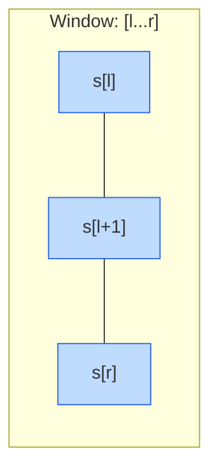
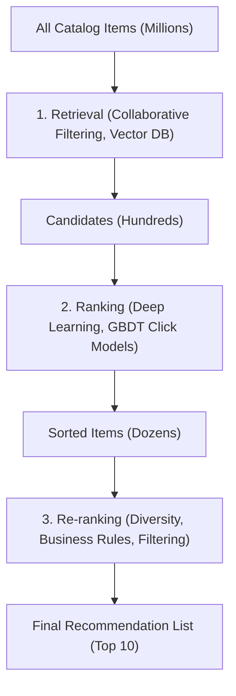

# 💼 Interview Prep & Case Studies

<!-- JSON-LD Structured Data for Search Engine & AI Crawler Indexing -->
<script type="application/ld+json">
{
  "@context": "https://schema.org",
  "@type": "TechArticle",
  "name": "Data Science & Machine Learning System Design Interview Preparation",
  "description": "Curated technical interview guide with solutions for advanced SQL scenarios, consecutive login streaks, sliding window algorithms, and recommender system architectures.",
  "inLanguage": "en",
  "author": {
    "@type": "Person",
    "name": "Sai Teja Bandaru"
  },
  "url": "https://github.com/saitejabandaru-in/AI-Data-Science-Resources/tree/main/interviews"
}
</script>

A structured prep guide featuring high-yield questions, clean coding implementations, and blueprints for machine learning system design interviews.

---

## 🧸 Interview Concepts Intuitive Analogies

*   **Sliding Window Algorithm:** Imagine you are looking at a row of houses through a small cardboard tube. Instead of walking all the way back to the start and recounting every house every time you take a step, you just **slide your tube one house forward**. You only look at the new house that enters the tube on the right, and forget the house that just slid out on the left. This saves a massive amount of time!
*   **Gaps & Islands (SQL):** Imagine a calendar where you put a star on days you studied. If you studied Monday, Tuesday, Thursday, and Friday, you have two **Islands** of consecutive study days (Mon-Tue, and Thu-Fri) separated by a **Gap** (Wednesday). Gaps & Islands is a SQL trick to group these consecutive blocks of dates together.
*   **Recommendation Funnel (System Design):** Imagine walking into a giant toy store with 10,000 toys.
    *   **Retrieval:** The store helper quickly grabs 100 toys they think you might like (e.g., if you like dinosaurs, they grab all dinosaur toys).
    *   **Ranking:** They score those 100 toys, sorting them from the most exciting to the least exciting.
    *   **Re-ranking:** They make sure there aren't too many duplicates (so you don't get 5 identical T-Rex toys) and present the top 10 on a table for you to choose.

---

## 🗺️ Table of Contents
1. [Advanced SQL Questions](#1-advanced-sql-questions)
2. [Python Algorithmic Coding](#2-python-algorithmic-coding)
3. [Machine Learning System Design Blueprints](#3-machine-learning-system-design-blueprints)
4. [🎁 Free Interview Prep Resources](#4-free-interview-prep-resources)

---

## 1. Advanced SQL Questions

### Scenario 1: Month-over-Month Active Users Growth
**Question:** Write a query to find the Month-over-Month (MoM) growth rate of Active Users. Assume you have a table `user_logins` with columns `login_id`, `user_id`, and `login_date`.

#### SQL Solution (PostgreSQL):
```sql
WITH monthly_active_users AS (
    SELECT 
        DATE_TRUNC('month', login_date)::date AS login_month,
        COUNT(DISTINCT user_id) AS active_users
    FROM user_logins
    GROUP BY 1
),
prev_month_metrics AS (
    SELECT 
        login_month,
        active_users,
        LAG(active_users, 1) OVER (ORDER BY login_month) AS prev_active_users
    FROM monthly_active_users
)
SELECT 
    login_month,
    active_users,
    prev_active_users,
    ROUND(
        100.0 * (active_users - prev_active_users) / prev_active_users, 
        2
    ) AS mom_growth_percent
FROM prev_month_metrics;
```

---

### Scenario 2: Gaps & Islands (Consecutive Login Streak)
**Question:** Write a SQL query to identify users who have logged in on 3 or more consecutive days.

#### SQL Solution (PostgreSQL):
```sql
WITH distinct_logins AS (
    -- Deduplicate logins per user per day
    SELECT DISTINCT 
        user_id, 
        login_date::date AS login_day
    FROM user_logins
),
login_groups AS (
    -- Group consecutive dates using row numbering difference
    SELECT 
        user_id,
        login_day,
        login_day - ROW_NUMBER() OVER(PARTITION BY user_id ORDER BY login_day)::int AS island_id
    FROM distinct_logins
),
streak_aggregations AS (
    SELECT 
        user_id,
        MIN(login_day) AS streak_start,
        MAX(login_day) AS streak_end,
        COUNT(*) AS streak_length
    FROM login_groups
    GROUP BY user_id, island_id
)
SELECT DISTINCT user_id, streak_length
FROM streak_aggregations
WHERE streak_length >= 3;
```

---

## 2. Python Algorithmic Coding

### Sliding Window Technique Visualization
Many substring and subarray problems can be optimized from $O(N^2)$ to $O(N)$ using the sliding window strategy, where a start and end pointer define the window boundaries:



---

### Problem 1: Merging Overlapping Intervals
**Question:** Given an array of intervals where `intervals[i] = [start, end]`, merge all overlapping intervals.

#### Python Solution:
```python
def merge_intervals(intervals: list[list[int]]) -> list[list[int]]:
    if not intervals:
        return []
    
    # Sort intervals by start time: O(N log N)
    intervals.sort(key=lambda x: x[0])
    
    merged = [intervals[0]]
    for current in intervals[1:]:
        prev_start, prev_end = merged[-1]
        curr_start, curr_end = current
        
        # If current interval overlaps with the previous one, merge them
        if curr_start <= prev_end:
            merged[-1][1] = max(prev_end, curr_end)
        else:
            merged.append(current)
            
    return merged

# Complexity: Time: O(N log N), Space: O(N) (for sorting/storage)
```

---

### Problem 2: Length of Longest Substring Without Repeating Characters
**Question:** Find the length of the longest substring without repeating characters using a sliding window.

#### Python Solution:
```python
def length_of_longest_substring(s: str) -> int:
    char_index_map = {}
    max_len = 0
    left = 0
    
    for right, char in enumerate(s):
        # If char was seen and is inside the current window, move the left boundary
        if char in char_index_map and char_index_map[char] >= left:
            left = char_index_map[char] + 1
            
        char_index_map[char] = right
        max_len = max(max_len, right - left + 1)
        
    return max_len

# Complexity: Time: O(N), Space: O(min(M, N)) where M is character alphabet size
```

---

## 3. Machine Learning System Design Blueprints

### Case Study: Recommender System Pipeline
Designing large scale recommendation systems (e.g., Netflix, YouTube) requires a multi-stage funnel to reduce millions of items to a small curated list:



#### Recommender Design Components:
1.  **Retrieval (Candidate Generation):** Fast filters (e.g., Approximate Nearest Neighbors) to screen out irrelevant items and produce a candidate set of a few hundred items.
2.  **Ranking (Scoring):** Fine-grained scoring using complex models (e.g., Deep & Cross Networks, XGBoost) to predict click-through rate (CTR).
3.  **Re-ranking (Post-processing):** Deduplication, diversity enhancement (prevent recommending 5 consecutive identical items), and business rules.

---

## 4. Free Interview Prep Resources

*   **[NeetCode](https://neetcode.io/)** - A structured roadmap of coding questions with step-by-step video explanations. Highly recommended for algorithmic practice.
*   **[LeetCode](https://leetcode.com/)** - The industry-standard platform for practicing SQL and algorithmic coding questions.
*   **[Chip Huyen's Machine Learning System Design](https://huyenchip.com/books/)** - The ultimate textbook resource for designing production-grade ML systems under real-world constraints.
*   **[Interactive SQL Exercises (SelectStarSQL)](https://selectstarsql.com/)** - Perfect for reviewing core SQL concepts before interviews.
