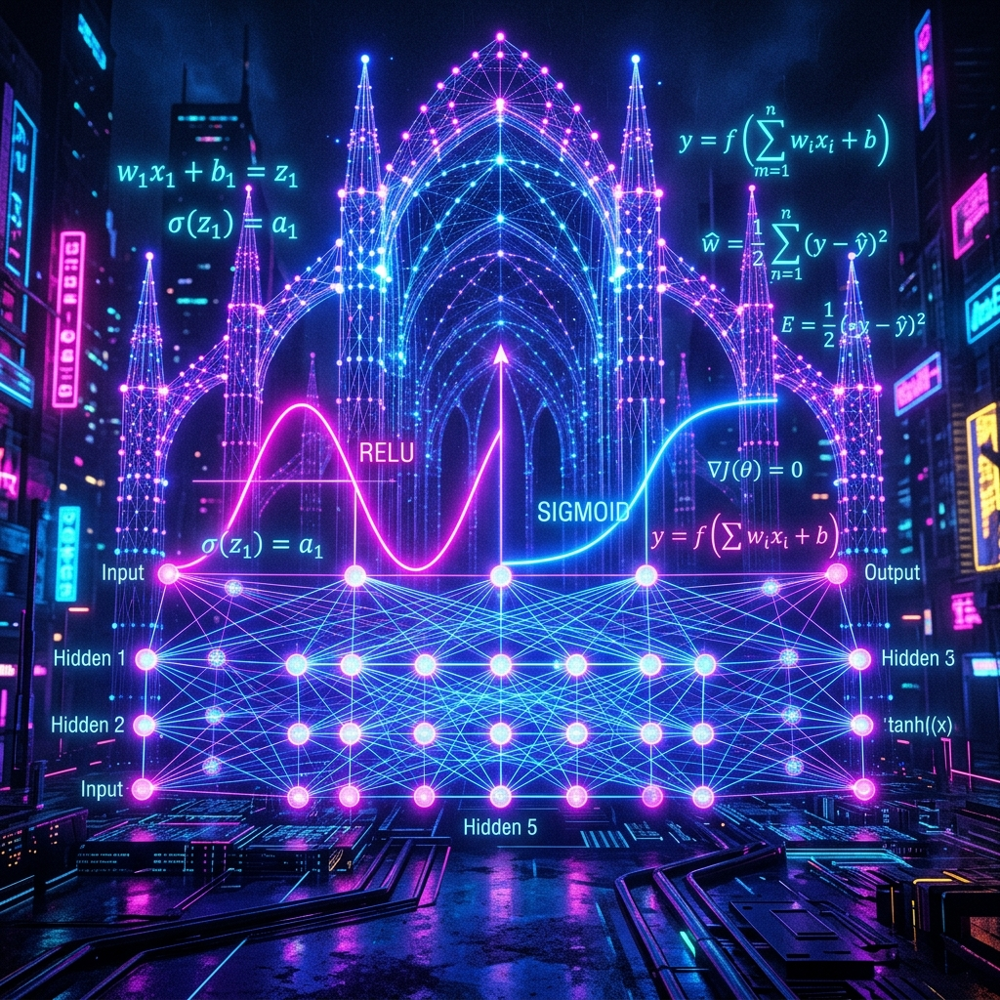
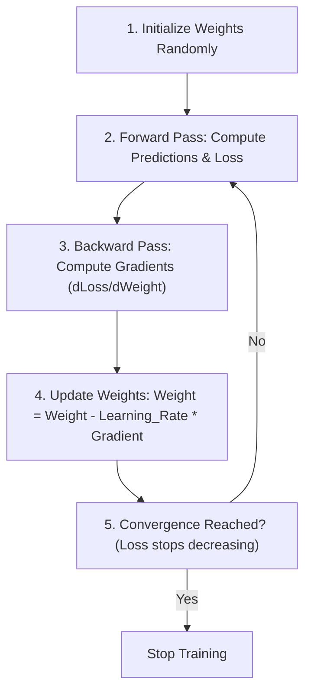
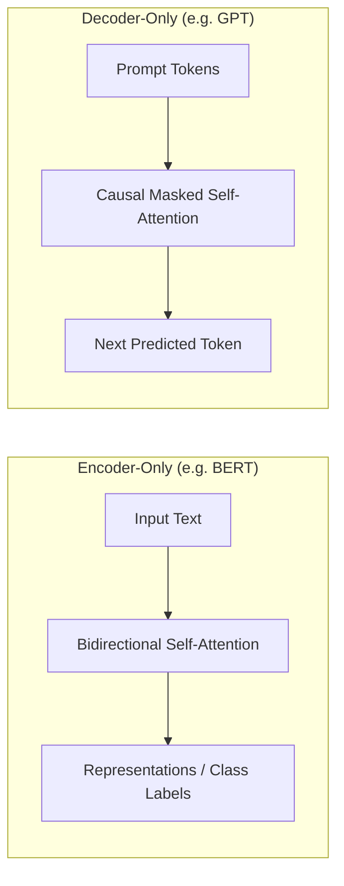
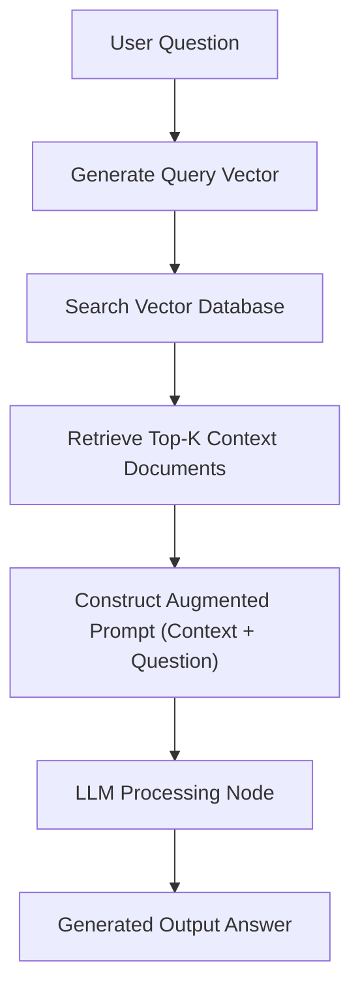

# 🧠 Quest 3: The Cathedral of Learning

  

<!-- JSON-LD Structured Data for Search Engine & AI Crawler Indexing
{
  "@context": "https://schema.org",
  "@type": "TechArticle",
  "name": "Machine Learning & Deep Learning Foundation Course Notes",
  "description": "Comprehensive notes covering ML linear algebra, calculus, probability estimation, tree ensembling, activation functions, backpropagation optimizers, Transformer causal attention, LoRA, and RAG pipelines.",
  "inLanguage": "en",
  "author": {
    "@type": "Person",
    "name": "Sai Teja Bandaru"
  },
  "url": "https://github.com/saitejabandaru-in/AI-Data-Science-Resources/tree/main/machine-learning"
}
-->

You enter the echoing chambers of the **Cathedral of Learning**. Floating neon matrices, loss vectors, and weight distributions glow in the dim vaults. This is the heart of the Archive.

To master this temple, you must grasp optimization calculus, train deep networks via Backpropagation, sculpt Transformer attention vectors, and build Retrieval-Augmented Generation (RAG) pipelines.

---

## 🧸 Machine Learning Intuitive Analogies

*   **Machine Learning** is teaching a computer by **showing it examples** instead of writing strict rules. It is like showing a toddler 100 photos of dogs until they can successfully point out a real dog in the park.
*   **Linear Regression** is like **drawing a line of best fit**. If a tree grows 2 feet every year, you draw a straight line upward to guess how tall it will be in 5 years.
*   **Overfitting** is like **memorizing the practice exam**. If a student memorizes the exact questions and answers on a practice test instead of learning the concepts, they will get a 100% on the practice test, but fail the actual final exam because the questions are slightly different.
*   **Neural Networks** are like a **chain of friends whispering to each other**. The first friend looks at an image (e.g., the letter "A") and whispers small clues to the next friend. The last friend in the chain guesses the letter. If they guess wrong, they pass the correction back along the line so everyone knows who to trust more next time (which is *backpropagation*).
*   **Self-Attention (Transformers)** is how computers **focus on context**. In the sentence: *"The bank of the river was muddy,"* self-attention connects the word **bank** to **river** so the computer knows it means a muddy slope of land, not a financial money bank.
*   **RAG (Retrieval-Augmented Generation)** is like taking an **open-book exam**. Instead of forcing a computer to answer questions purely from memory (which can make it write fake facts, i.e., *hallucinations*), it searches a library first, pulls out the most relevant pages, and uses those pages to write a correct answer.

---

## 🗺️ Table of Contents
1. [Mathematics of Machine Learning](#1-mathematics-of-machine-learning)
2. [Classical Machine Learning Algorithms](#2-classical-machine-learning-algorithms)
3. [Deep Learning Foundations](#3-deep-learning-foundations)
4. [Generative AI & Large Language Models (LLMs)](#4-generative-ai--large-language-models-llms)
5. [🎁 Free Machine Learning & Deep Learning Resources](#5-free-machine-learning--deep-learning-resources)

---

## 1. Mathematics of Machine Learning

Understanding the mathematics under the hood is critical for debugging model weights, loss divergence, and optimization paths.

### 📐 Linear Algebra
*   **Eigenvalues and Eigenvectors:** For a square matrix $A$, a non-zero vector $v$ satisfies:
    $$A v = \lambda v$$
    where $\lambda$ represents the eigenvalue. In PCA (Principal Component Analysis), eigenvectors represent the principal axes of variance.
*   **Matrix Decomposition (SVD):** Decomposes any matrix $A$ of dimensions $m \times n$ into three matrices:
    $$A = U \Sigma V^T$$
    Used in collaborative filtering recommendation engines and data compression.

### 📈 Calculus
*   **The Gradient ($\nabla f$):** The vector of partial derivatives pointing in the direction of steepest ascent:
    $$\nabla f(x_1, x_2, \dots, x_n) = \left[ \frac{\partial f}{\partial x_1}, \frac{\partial f}{\partial x_2}, \dots, \frac{\partial f}{\partial x_n} \right]$$
*   **Hessian Matrix:** The square matrix of second-order partial derivatives, denoting the local curvature of a function. Used in second-order optimization methods like Newton-Raphson (and XGBoost's custom objective expansions).

### 🎲 Probability & Estimation
*   **Bayes' Theorem:**
    $$P(A|B) = \frac{P(B|A)P(A)}{P(B)}$$
*   **Maximum Likelihood Estimation (MLE):** Estimates model parameters by maximizing the likelihood of the observed data:
    $$\theta_{\text{MLE}} = \arg\max_{\theta} \log P(X|\theta)$$
*   **Maximum A Posteriori (MAP):** Introduces a prior probability distribution $P(\theta)$ (acting as a regularizer):
    $$\theta_{\text{MAP}} = \arg\max_{\theta} \left[ \log P(X|\theta) + \log P(\theta) \right]$$

---

## 2. Classical Machine Learning Algorithms

### Linear and Logistic Regression
*   **Regularization Cost Functions:**
    *   **L1 Regularization (Lasso):** Introduces absolute penalty: $\lambda \sum |\theta_i|$. Generates sparse weights (forces coefficients to zero), acting as a built-in feature selector.
    *   **L2 Regularization (Ridge):** Introduces squared penalty: $\lambda \sum \theta_i^2$. Minimizes coefficients without forcing them to zero. Good for handling multicollinearity.
    *   **ElasticNet:** Linear combination of L1 and L2 penalties.

### Tree-Based Ensemble Methods
*   **Random Forests:** Bagging (Bootstrap Aggregation) technique. Trains multiple decision trees in parallel on bootstrap samples. Reduces variance without changing bias.
*   **Gradient Boosting Decision Trees (GBDT):** Boosting technique. Trains trees sequentially, with each tree fitting the residual errors of the previous ensemble. Highly optimized frameworks:
    *   **XGBoost:** Utilizes pre-sorted splitting, weighted quantile sketch, and Taylor expansion for custom loss functions.
    *   **LightGBM:** Employs Leaf-wise growth (instead of Level-wise) and GOSS (Gradient-based One-Side Sampling) for high speed on massive datasets.

---

## 3. Deep Learning Foundations

### Optimization & Gradient Descent

Gradient descent works by stepping parameters in the negative direction of the gradient to reach the minimum of the loss curve:

### Activation Functions
*   **ReLU:** $f(x) = \max(0, x)$. Mitigates vanishing gradient issues but can suffer from "dying ReLU" (inactive neurons).
*   **GELU (Gaussian Error Linear Unit):** $f(x) = x \cdot \Phi(x)$ (where $\Phi(x)$ is the cumulative distribution function of the standard normal distribution). Used in BERT, GPT, and modern transformer architectures.

### Optimization & Backpropagation
Modern neural networks adjust weights using the Chain Rule to propagate loss backward from the output layer:
$$\frac{\partial L}{\partial w_{ij}} = \frac{\partial L}{\partial a_j} \cdot \frac{\partial a_j}{\partial z_j} \cdot \frac{\partial z_j}{\partial w_{ij}}$$

#### Common Optimizers:
- **SGD (Stochastic Gradient Descent):** Updates weights based on mini-batches.
- **Adam (Adaptive Moment Estimation):** Tracks both first moment (momentum) and second moment (uncentered variance) of gradients to scale learning rate dynamically per parameter.
- **AdamW:** Corrects Adam's weight decay behavior by decoupling weight decay from the gradient update step.

---

## 4. Generative AI & Large Language Models (LLMs)

### The Transformer (Self-Attention)
Introduced in *Attention Is All You Need* (2017). Replaced recurrent networks (LSTMs) with self-attention, enabling massive parallelization.

$$\text{Attention}(Q, K, V) = \text{softmax}\left(\frac{QK^T}{\sqrt{d_k}}\right)V$$

where:
*   $Q$ (Query), $K$ (Key), $V$ (Value) are linear projections of input embeddings.
*   $\sqrt{d_k}$ is the scaling factor (dimension of keys) to prevent dot-products from growing too large in high dimensions.

### Model Architectures: Encoder vs. Decoder

### Parameter-Efficient Fine-Tuning (PEFT)
*   **LoRA (Low-Rank Adaptation):** Keeps base model weights frozen. Injects trainable rank decomposition matrices ($A$ and $B$) into the attention layers.
    $$W_{\text{updated}} = W_{\text{frozen}} + \Delta W \quad \text{where} \quad \Delta W = B \cdot A$$
*   **QLoRA (Quantized LoRA):** Compresses the base model to 4-bit NormalFloat (NF4) and uses Double Quantization to further reduce RAM usage during LoRA fine-tuning.

### Retrieval-Augmented Generation (RAG)
Augments LLMs with external, dynamic data sources without re-training.

---

## 5. Free Machine Learning & Deep Learning Resources

*   **[StatQuest with Josh Starmer](https://www.youtube.com/@statquest)** - The absolute best channel for making complex ML and statistics concepts intuitive with clear, step-by-step visual aids.
*   **[Fast.ai (Practical Deep Learning for Coders)](https://course.fast.ai/)** - An incredible top-down, code-first course that teaches you how to train state-of-the-art models from day one.
*   **[Stanford CS229: Machine Learning Course Lectures](https://cs229.stanford.edu/)** - The legendary Stanford course taught by Andrew Ng. Excellent for mathematical foundations.
*   **[Andrej Karpathy's Neural Networks: Zero to Hero](https://karpathy.ai/zero-to-hero.html)** - An amazing series of video tutorials building neural networks (like GPT) from scratch in PyTorch.
*   **[Hugging Face Course](https://huggingface.co/learn/nlp-course)** - Learn how to use Hugging Face libraries for NLP, tokenization, model loading, and fine-tuning.
