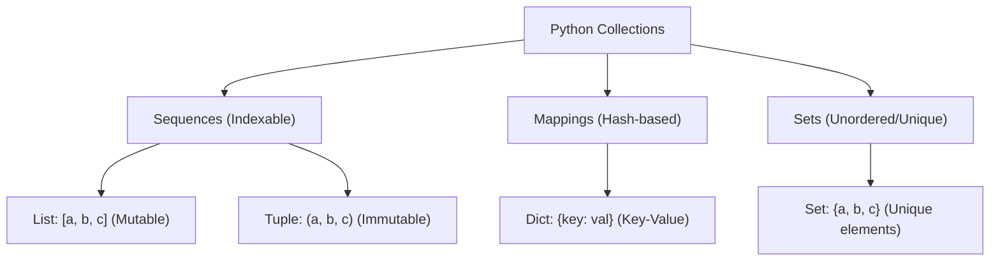
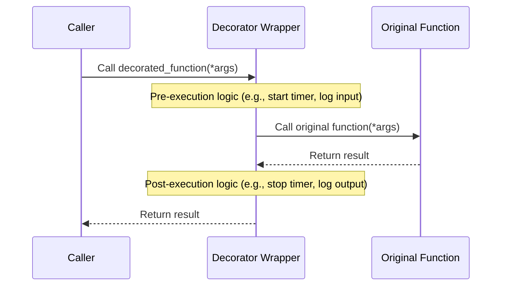

# 🐍 Python & Scientific Computing

<!-- JSON-LD Structured Data for Search Engine & AI Crawler Indexing
<script type="application/ld+json">
{
  "@context": "https://schema.org",
  "@type": "TechArticle",
  "name": "Python Programming & High-Performance Scientific Computing Notes",
  "description": "Comprehensive guide on Python data structures complexity, OOP abstractions, decorators, generators, Pandas vectorization, and Polars lazy evaluation benchmarks.",
  "inLanguage": "en",
  "author": {
    "@type": "Person",
    "name": "Sai Teja Bandaru"
  },
  "url": "https://github.com/saitejabandaru-in/AI-Data-Science-Resources/tree/main/python"
}
</script>
-->

Python is the lingua franca of data engineering, machine learning, and AI research. This module details core language concepts, Object-Oriented Programming (OOP), advanced execution patterns, and performance tuning techniques for large-scale data manipulation.

---

## 🧸 Python Intuitive Analogies

*   **Variables** are like **labeled boxes**. You can put a toy inside a box labeled `my_toy = "bear"`. Whenever you ask Python for `my_toy`, it opens the box and shows you the bear!
*   **Data Structures** are different types of containers:
    *   **List (`[]`)**: A **grocery list**. You can add items, cross items off, and sort them, and the order they are in matters.
    *   **Tuple (`()`)**: A **treasure map coordinate** (e.g., Latitude and Longitude). Once it's written down, you can never change it (it is *immutable*).
    *   **Set (`{}`)**: A **bag of marbles**. All marbles must be unique colors (no duplicates allowed!), and they just jumble around in no particular order.
    *   **Dictionary (`{:}`)**: A **phone book**. You look up a friend's name (the *Key*) to find their phone number (the *Value*).
*   **Object-Oriented Programming (OOP)** is like building with **LEGO blueprints**. A **Class** is the paper instructions showing how to build a LEGO car. An **Object (Instance)** is the actual, physical LEGO car you build using those instructions.
*   **Decorators** are like **wrapping paper**. You have a present (a function). A decorator wraps around the present, adding shiny wrapping paper and a nice bow (extra timing, logging, or security logic) without changing the actual present inside.
*   **Generators (`yield`)** are like a **slow water faucet**. Instead of filling a giant, heavy swimming pool with water all at once (which takes up all your RAM memory), a generator gives you one single drop of water at a time, only when you ask for it.

---

## 🗺️ Table of Contents
1. [Core Data Structures & Complexity](#1-core-data-structures--complexity)
2. [Object-Oriented Programming (OOP) & Dataclasses](#2-object-oriented-programming-oop--dataclasses)
3. [Advanced Patterns: Decorators, Generators, Context Managers](#3-advanced-patterns-decorators-generators-context-managers)
4. [High-Performance Scientific Computing (Pandas vs. Polars)](#4-high-performance-scientific-computing-pandas-vs-polars)
5. [🎁 Free Python & Data Science Learning Resources](#5-free-python--data-science-learning-resources)

---

## 1. Core Data Structures & Complexity

Writing performant code begins with selecting the correct built-in data structure.



| Structure | Syntax | Ordering | Mutability | Average Access | Average Insertion | Common Use Case |
| :--- | :--- | :--- | :--- | :--- | :--- | :--- |
| **List** | `[1, 2]` | Ordered | Mutable | $O(1)$ | $O(1)$ (append) | Storing sequences |
| **Tuple** | `(1, 2)` | Ordered | Immutable | $O(1)$ | N/A | Static coordinates, database keys |
| **Set** | `{1, 2}` | Unordered | Mutable | $O(1)$ | $O(1)$ | Membership testing, deduplication |
| **Dict** | `{'a': 1}`| Ordered* | Mutable | $O(1)$ | $O(1)$ | Key-value associative mapping |

*\*Note: Dictionaries maintain insertion order starting in Python 3.7+.*

---

## 2. Object-Oriented Programming (OOP) & Dataclasses

AI systems require robust engineering. Clean OOP structures make codebases modular and reusable.

### Abstract Base Classes (ABCs)
Enforce interfaces on child classes. Useful for defining common steps in model pipelines.

```python
from abc import ABC, abstractmethod

class BasePredictor(ABC):
    @abstractmethod
    def fit(self, X, y):
        """Train the model."""
        pass
    
    @abstractmethod
    def predict(self, X):
        """Output predictions."""
        pass
```

### Magic (Dunder) Methods
Enable built-in operators on custom objects.
- `__init__`: Constructor.
- `__repr__`: Official developer string representation.
- `__call__`: Allows instances of classes to be called as functions (e.g., PyTorch models).

### Modern Dataclasses (`@dataclass`)
Simplifies class definitions for structured data storage by automatically generating `__init__`, `__repr__`, and `__eq__`.

```python
from dataclasses import dataclass, field

@dataclass(frozen=True)  # frozen=True makes the instances immutable
class Hyperparameters:
    learning_rate: float = 1e-3
    batch_size: int = 64
    optimizer: str = "Adam"
    epochs: int = field(default=10, metadata={"help": "Number of passes"})
```

---

## 3. Advanced Patterns: Decorators, Generators, Context Managers

### 1. Decorators
Modify the behavior of functions or classes without permanently altering their code.



```python
import time
from functools import wraps

def time_execution(func):
    @wraps(func)  # Preserves target function's metadata
    def wrapper(*args, **kwargs):
        start = time.perf_counter()
        result = func(*args, **kwargs)
        end = time.perf_counter()
        print(f"⏱️ {func.__name__} completed in {end - start:.4f}s")
        return result
    return wrapper

@time_execution
def train_dummy_model():
    time.sleep(1.5)  # Simulate model training
```

### 2. Generators
Functions that use `yield` instead of `return` to return an iterator that yields one item at a time.
*   **Memory Efficiency:** Crucial when reading large datasets (e.g., multi-gigabyte text files) that shouldn't load entirely into RAM.

```python
def stream_large_file(file_path: str):
    with open(file_path, "r", encoding="utf-8") as file:
        for line in file:
            yield line.strip()
```

### 3. Context Managers
Manage setup and teardown resources cleanly via the `with` statement.
*   Implemented using `__enter__` and `__exit__` methods, or the `@contextmanager` decorator.

---

## 4. High-Performance Scientific Computing (Pandas vs. Polars)

### Vectorization over Iteration
Never use `for` loops or `.apply()` in Pandas if a vectorized solution exists. Vectorized operations run in compiled C/C++ or Fortran.

```python
# 🛑 AVOID (Slow row-by-row iteration)
df['new_col'] = df.apply(lambda row: row['a'] * row['b'], axis=1)

# ✅ PREFER (Vectorized operation)
df['new_col'] = df['a'] * df['b']
```

### Downcasting Data Types
Saves RAM. Convert generic `float64` to `float32`, or strings to `category`.
```python
# Convert categorical strings to category
df['user_country'] = df['user_country'].astype('category')
```

### Polars: The Next Generation
Polars is a blazingly fast DataFrame library written in Rust. It utilizes:
1.  **Lazy Evaluation:** Optimization queries prior to execution.
2.  **No GIL constraints:** Fully multithreaded query plans.

```python
import polars as pl

# Expressing lazy pipeline (won't execute until collect() is called)
lazy_query = (
    pl.scan_csv("large_dataset.csv")
    .filter(pl.col("age") > 30)
    .group_by("occupation")
    .agg(pl.col("salary").mean())
)

# Runs execution with optimal Rust query planer
results = lazy_query.collect()
```

---

## 5. Free Python & Data Science Learning Resources

Learn python and its scientific computing libraries with these free high-quality tutorials:

*   **[Python.org Tutorial](https://docs.python.org/3/tutorial/)** - The official Python introduction. Extremely thorough and accurate.
*   **[Real Python](https://realpython.com/)** - Premium, beginner-friendly tutorials, deep-dives, and code snippets.
*   **[Python for Everybody (Charles Severance)](https://www.py4e.com/)** - The most popular introductory Python course, completely free with videos and exercises.
*   **[Kaggle Learn: Python](https://www.kaggle.com/learn/python)** - Short, interactive exercises designed to get you ready for Data Science.
*   **[Polars User Guide](https://docs.pola.rs/)** - The official user guide for transitioning from Pandas to Rust-powered Polars DataFrames.
