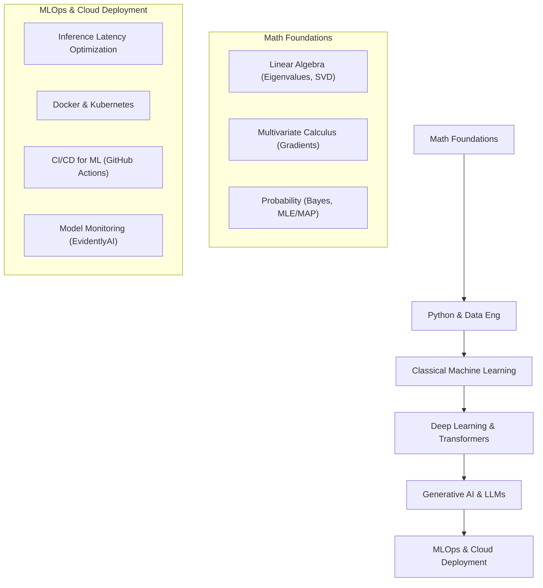
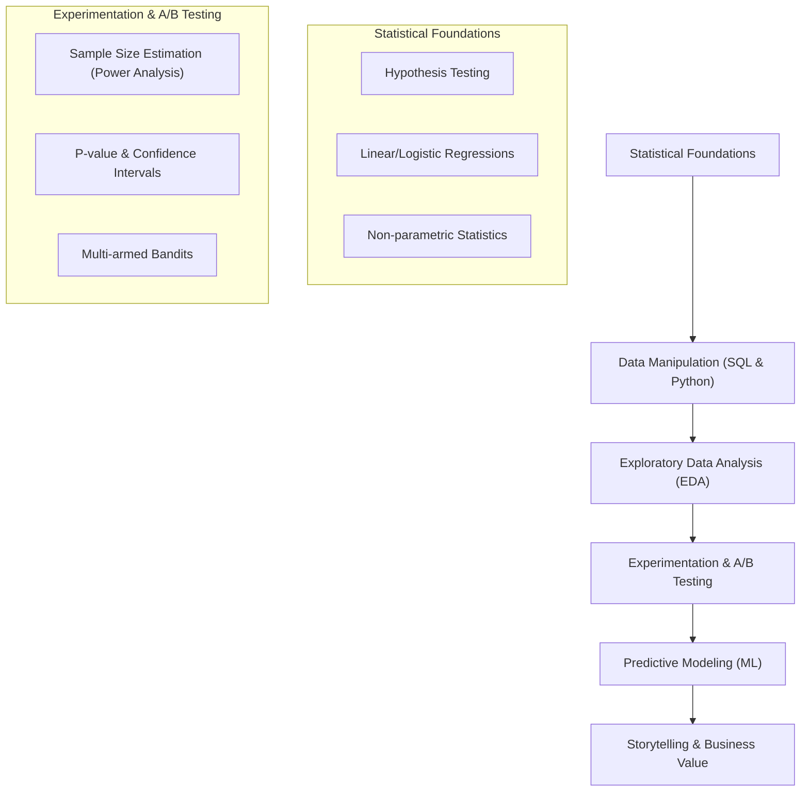
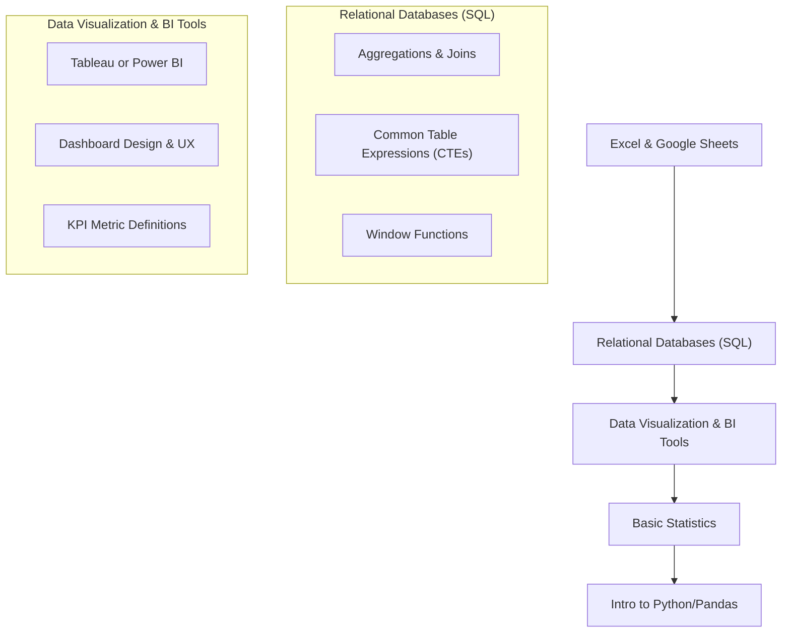

# 🛤️ Data Science & AI Roadmaps

<!-- JSON-LD Structured Data for Search Engine & AI Crawler Indexing -->

Detailed milestone roadmaps for three major industry roles: Machine Learning Engineer, Data Scientist, and Data Analyst.

---

## 🗺️ Table of Contents
1. [Machine Learning Engineer (MLE) / AI Specialist](#1-machine-learning-engineer-mle--ai-specialist)
2. [Data Scientist (DS)](#2-data-scientist-ds)
3. [Data Analyst (DA)](#3-data-analyst-da)

---

## 1. Machine Learning Engineer (MLE) / AI Specialist

An MLE designs, builds, optimizes, and deploys production-grade machine learning models and pipelines.

### Essential Skills Checklist:
- [ ] **Data pipelines:** PySpark, SQL, dbt, Polars.
- [ ] **Classical ML:** Scikit-Learn, XGBoost, LightGBM.
- [ ] **Deep Learning:** PyTorch, PyTorch Lightning.
- [ ] **Modern AI:** Transformers (Hugging Face), PEFT/LoRA, RAG.
- [ ] **Serving & MLOps:** Docker, FastAPI, Triton Inference Server, Kubernetes, MLflow.

---

## 2. Data Scientist (DS)

A Data Scientist extracts insights from data, designs experiments, and builds predictive models to solve complex business problems.

### Essential Skills Checklist:
- [ ] **Programming:** Python (Pandas, Numpy, Seaborn), SQL.
- [ ] **Statistics:** Hypothesis tests (t-test, ANOVA, chi-square), experimental design.
- [ ] **Modeling:** Regression, clustering, time-series forecasting.
- [ ] **Business communication:** Data storytelling, PowerPoint, Executive summaries.

---

## 3. Data Analyst (DA)

A Data Analyst queries, aggregates, and visualizes structured data to help organizations make data-driven decisions.

### Essential Skills Checklist:
- [ ] **Data retrieval:** Advanced SQL (Window functions, CTEs).
- [ ] **BI tools:** Tableau, PowerBI, Looker Studio.
- [ ] **Reporting:** Automated scheduling, dashboard building.
- [ ] **Foundational programming:** Python (Pandas) or R.
