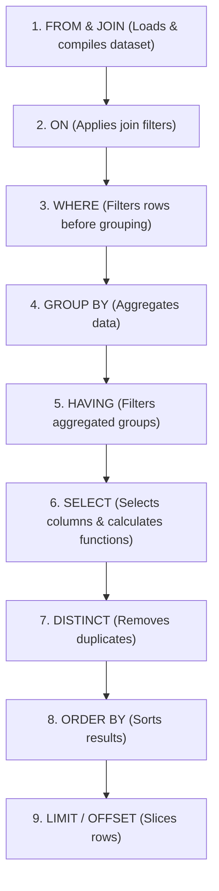
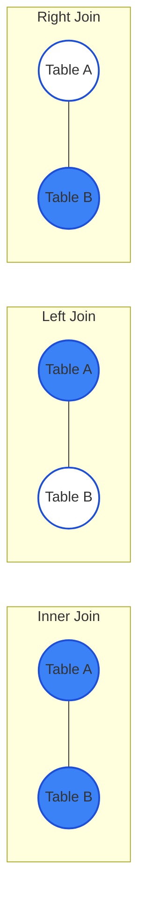

# 📊 SQL Core & Advanced Notes

SQL is the foundational language of data retrieval, transformation, and analysis. This module covers core relational engine concepts, advanced window functions, and query optimization strategies crucial for database engineering and data science.

---

## 🧸 SQL Intuitive Analogies

*   **Database tables** are like massive spreadsheets filled with rows of information.
*   **SQL Queries** are like ordering a custom burger at a restaurant:
    *   `FROM`: Tell the kitchen which fridge to open to get the ingredients.
    *   `WHERE`: Throw away any spoiled or incorrect ingredients (filters).
    *   `GROUP BY`: Stack similar ingredients together (e.g., group all beef patties together).
    *   `SELECT`: Put the chosen ingredients on the plate to serve to the customer!
*   **Window Functions** are like having a **spotlight** in a classroom. Instead of mixing all students into a single average grade (which is what `GROUP BY` does), a window function lets you keep all students on the screen, but shines a spotlight on their individual ranking or their difference from the classmate sitting next to them.
*   **CTEs (Common Table Expressions)** are like **sticky notes**. When solving a long math problem, you write down intermediate calculations on a sticky note so you don't lose track, then throw the sticky note away when the final answer is solved.
*   **Database Indexes** are like the **index at the back of a textbook**. If you want to find the word "Query", you don't read all 1,000 pages (which is a slow *Sequential Scan*). You look at the index at the back, find the page number, and flip directly to it (a fast *Index Scan*).

---

## 🗺️ Table of Contents
1. [SQL Query Execution Order](#1-sql-query-execution-order)
2. [Visual Join Guide](#2-visual-join-guide)
3. [Advanced Window Functions](#3-advanced-window-functions)
4. [CTEs vs. Subqueries vs. Temporary Tables](#4-ctes-vs-subqueries-vs-temporary-tables)
5. [Query Optimization & Performance Tuning](#5-query-optimization--performance-tuning)
6. [🎁 Free SQL Learning & Practice Resources](#6-free-sql-learning--practice-resources)

---

## 1. SQL Query Execution Order

While SQL code is written starting with the `SELECT` keyword, the database engine executes commands in a logical order that dictates variable availability and performance behaviors.

### Logical Query Execution Pipeline



> [!WARNING]
> Because `SELECT` is executed *after* `WHERE` and `HAVING`, column aliases defined in your `SELECT` clause cannot be referenced in `WHERE` or `HAVING` filters in standard SQL.

---

## 2. Visual Join Guide

Joins combine rows from two or more tables based on a related column between them.



*   **INNER JOIN:** Returns records that have matching values in both tables.
*   **LEFT (OUTER) JOIN:** Returns all records from the left table, and the matched records from the right table. Fill with `NULL` if no match exists.
*   **RIGHT (OUTER) JOIN:** Returns all records from the right table, and the matched records from the left table.
*   **FULL (OUTER) JOIN:** Returns all records when there is a match in either left or right table.
*   **CROSS JOIN:** Returns the Cartesian product of the two tables (every row of A paired with every row of B).

---

## 3. Advanced Window Functions

Window functions perform calculations across a set of table rows that are somehow related to the current row, without collapsing them into a single row like `GROUP BY` does.

### Core Syntax
```sql
FUNCTION() OVER (
    PARTITION BY column_a
    ORDER BY column_b
    ROWS BETWEEN UNBOUNDED PRECEDING AND CURRENT ROW
)
```

### Row Numbering & Ranking Comparison
Given a dataset with duplicate scores:
- `ROW_NUMBER()`: Assigns a unique sequential integer (e.g., 1, 2, 3, 4).
- `RANK()`: Assigns ranking, leaving gaps for ties (e.g., 1, 2, 2, 4).
- `DENSE_RANK()`: Assigns ranking without leaving gaps (e.g., 1, 2, 2, 3).

| Employee | Department | Salary | ROW_NUMBER() | RANK() | DENSE_RANK() |
| :--- | :--- | :--- | :--- | :--- | :--- |
| Alice | Engineering | 150,000 | 1 | 1 | 1 |
| Bob | Engineering | 120,000 | 2 | 2 | 2 |
| Charlie | Engineering | 120,000 | 3 | 2 | 2 |
| David | Engineering | 100,000 | 4 | 4 | 3 |

### Boundary Tracking (`LEAD` & `LAG`)
Accesses data from another row in the same result set without using self-joins.
- `LAG(column, offset)`: Retrieves a value from the row *before* the current row. Excellent for month-over-month growth calculations.
- `LEAD(column, offset)`: Retrieves a value from the row *after* the current row.

```sql
SELECT 
    revenue_month,
    monthly_revenue,
    LAG(monthly_revenue, 1) OVER (ORDER BY revenue_month) as prev_month_revenue,
    monthly_revenue - LAG(monthly_revenue, 1) OVER (ORDER BY revenue_month) as net_change
FROM sales_records;
```

---

## 4. CTEs vs. Subqueries vs. Temporary Tables

Selecting the correct temporary storage mechanism depends on scope, readability, and performance.

### 1. Common Table Expressions (CTEs)
Defined using the `WITH` clause. They exist only during the execution of the query.
*   **Best for:** Code readability, hierarchical query design, and recursive tasks (e.g., parsing org charts).
*   **Performance Note:** Historically, PostgreSQL and other RDBMS materialized CTEs (creating temp tables in memory). Modern optimizers inline CTEs, making them perform similarly to subqueries.

### 2. Subqueries
Nested inside other queries.
*   **Best for:** Short, inline filters (e.g., `WHERE salary > (SELECT AVG(salary) FROM employees)`).
*   **Disadvantage:** Can lead to unreadable "spaghetti SQL" if nested deeply.

### 3. Temporary Tables (`CREATE TEMP TABLE`)
Physically instantiated tables stored in memory or temporary disk segments that last for the duration of the session.
*   **Best for:** Complex multi-step processing pipelines where intermediate results are reused multiple times, or require indexing.

---

## 5. Query Optimization & Performance Tuning

High-performance SQL requires optimizing how the execution engine reads and processes tables.

### Indexing: The B-Tree and Beyond
Indexes are lookup structures that prevent full table scans.
*   **B-Tree Indexes:** Default. Ideal for equality operations (`=`) and range queries (`>`, `<`).
*   **Hash Indexes:** Excellent for exact matches (`=`) but cannot perform range scans or sort values.
*   **GIN (Generalized Inverted Index) Indexes:** Perfect for multi-value columns (JSONB, Arrays) and text search.

### Partitioning
Dividing large tables into smaller, physical tables behind the scenes.
*   **Range Partitioning:** (e.g., by Transaction Date).
*   **List Partitioning:** (e.g., by Country Code).
*   **Hash Partitioning:** Distributes rows evenly based on a hash key.

### Reading Execution Plans (`EXPLAIN ANALYZE`)
Prepend `EXPLAIN ANALYZE` to your query to see how the engine plans and executes it.

Key operations to audit:
*   **Seq Scan (Sequential Scan):** The engine is reading the entire table from disk. Bad for large tables; solve by adding an index.
*   **Index Scan:** The engine uses an index to locate rows. Very fast.
*   **Hash Join vs. Nested Loop:**
    *   *Nested Loop:* Compares every row of table A with table B. Fine for small datasets, terrible for large ones.
    *   *Hash Join:* Builds a hash table in memory of the smaller relation, then scans the larger relation. Highly efficient.

---

## 6. Free SQL Learning & Practice Resources

Accelerate your SQL skills with these high-quality interactive tools and sites:

*   **[Select Star SQL](https://selectstarsql.com/)** - An interactive online book that guides you through SQL using a real-world database. Perfect for absolute beginners.
*   **[SQLZoo](https://sqlzoo.net/)** - A interactive platform filled with hands-on practice tutorials and quizzes for all levels.
*   **[LeetCode SQL 50 Study Plan](https://leetcode.com/studyplan/30-days-of-sql/)** - Curated list of 50 core SQL questions to prepare for data science interviews.
*   **[DB Fiddle](https://www.db-fiddle.com/)** - A browser-based database sandbox supporting PostgreSQL, MySQL, and SQLite. Use it to write and test your SQL queries on the fly.
*   **[SQLBolt](https://sqlbolt.com/)** - Step-by-step interactive lessons to learn SQL from scratch.
